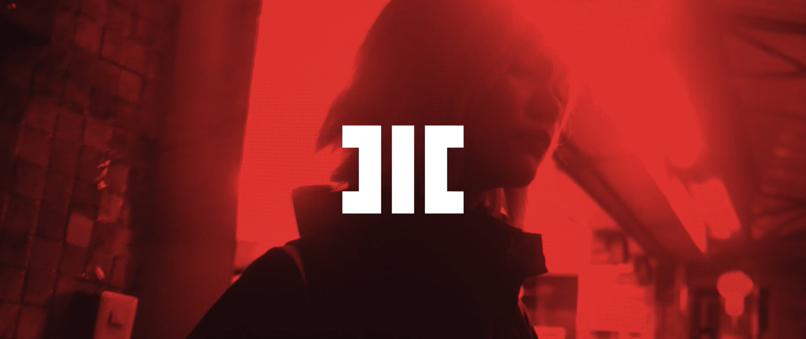

[cover] 

# MOTHNODE_ Tribe (prod. in:exhale/Sylar)

**Listen now:** 

## Project Data

Mix - [FREE] HARD DARK MELODIC FUKKSAILOR X COMETHAZINE X OKAMINOKAMI TYPE BEAT | PROD. SYLER
https://www.youtube.com/watch?v=yGN2QfgfHIk

**Title:** Tribe / **Featuring:** MOTHNODE

**Production:** in:exhale/Sylar / **Lyrics:** MOTHNODE

## Lyrics

```
hitech crime (electronic voice, glitch, GLADOS style but with darkness)
*whistling wind, some electronic noises of the street, like buzzing electricity from neons*

HOOK (coming up)

With gold come knots tied on tight klout calls
For blood, sacrifice darkness to the rap gods
My tribe uses doubt and fear to conquer flaws 

CHORUS (drop)

With gold come knots tied on tight klout calls
For blood, sacrifice darkness to the rap gods
My tribe uses doubt and fear to conquer flaws 

Fear in the eyes of the public
When I drop the bombs
Landlines filled with blots
I slides what everybody does, anybody knows 
that

ominous voice

```

## Lyrics Testing Ground

16bar - verse

*italics* run in
**bold**

| x | 1 | 2 | 3 | 4 |
|---|---|---|---|---|
| 1 | *i'm in a* **fast** food | **joint** and i just  | **or**dered a  | **la**tte  |
| 2 | *the* **ca**shier | **tu**rns away  |  **con**veying what |  **i** placed |
| 3 | *i'm* **tempt**ed in a | **u**nique way  |  **you** probably |  **won't** think |
| 4 | *as i* **reach** to grab the |  **mic** i contem-  | **plate** what i | **might** say |

## Notes

## Music Video
